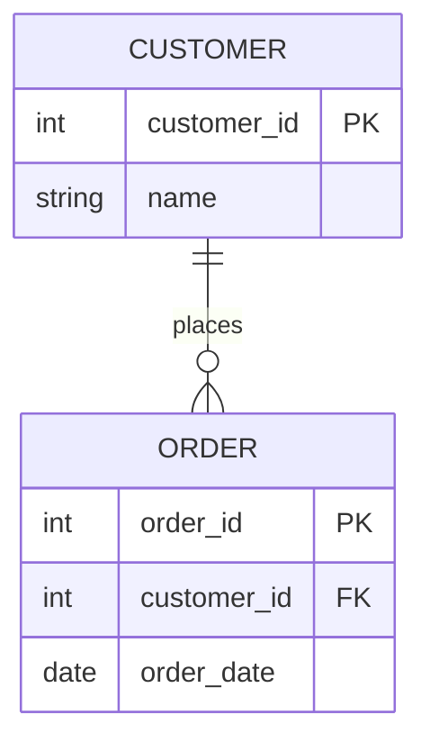

```mermaid
erDiagram
CUSTOMER ||--o{ ORDER : places

    CUSTOMER {
        int customer_id PK
        string name
    }

    ORDER {
        int order_id PK
        int customer_id FK
        date order_date
    }
```

# Tesing section
